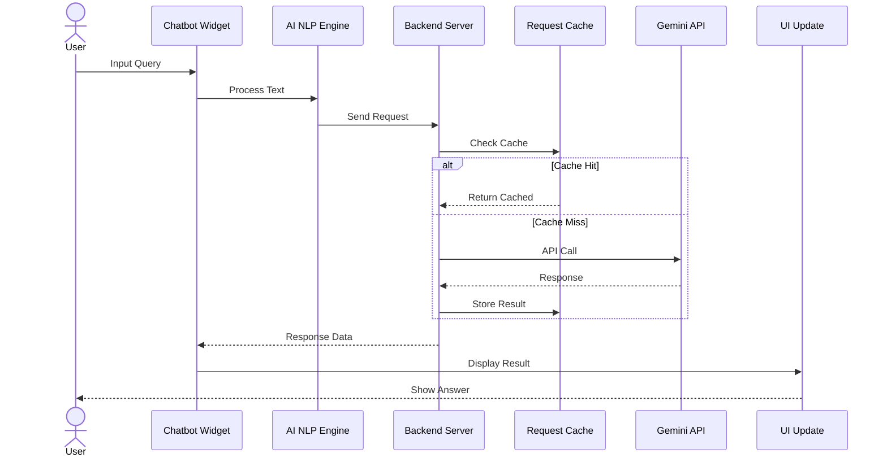
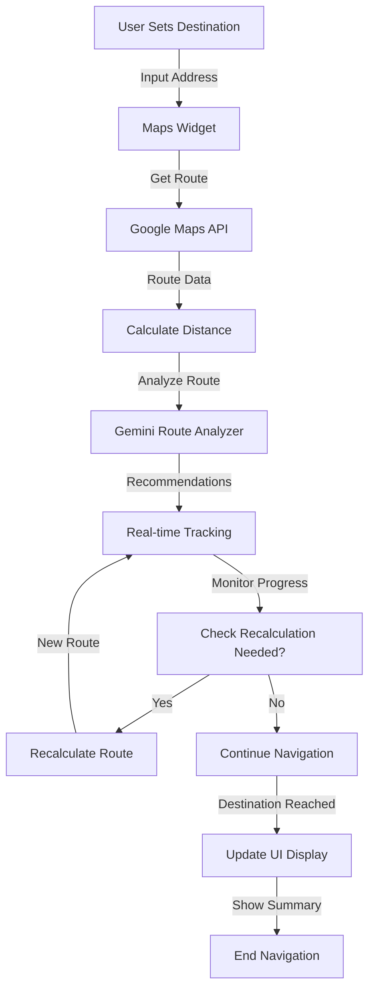
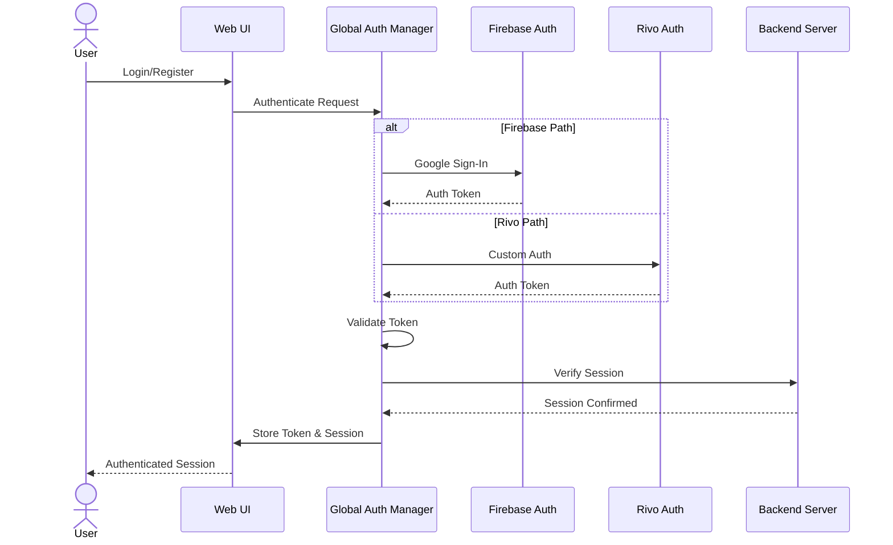
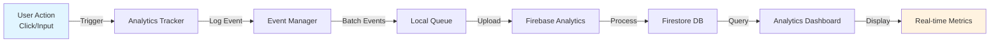
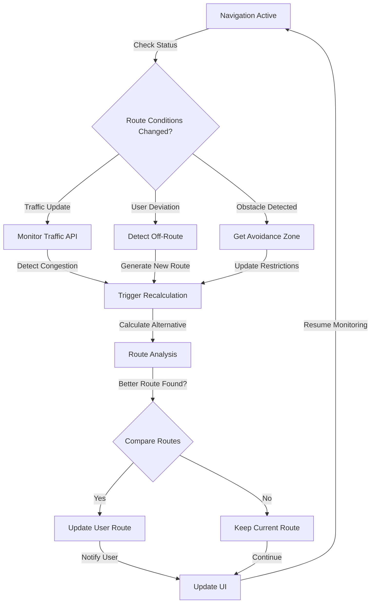

# Rivo Google AI - System Architecture

## Overall Architecture Diagram

```mermaid
graph TB
    subgraph Client["Client Layer"]
        UI["Web UI<br/>HTML/CSS/JS"]
        Chatbot["Chatbot Widget<br/>chatbot-widget.js"]
        Maps["Interactive Maps<br/>rivoazuremap.html"]
    end

    subgraph Auth["Authentication Layer"]
        FirebaseAuth["Firebase Auth<br/>firebase-auth.js"]
        RivoAuth["Rivo Auth<br/>rivo-auth.js"]
        GlobalAuth["Global Auth Manager<br/>global-auth.js"]
    end

    subgraph Frontend["Frontend Services"]
        AIEngine["AI NLP Engine<br/>ai-nlp-engine.js"]
        Helpers["Helper Utils<br/>helpers.js"]
        LocalStorage["Local Storage Manager<br/>local-storage.js"]
        Layout["Layout Manager<br/>layout.js"]
    end

    subgraph Backend["Backend Layer"]
        Server["Node.js Server<br/>server.js"]
        Routes["API Routes"]
        Cache["Request Cache"]
        Models["AI Models"]
    end

    subgraph Services["External Services"]
        Firebase["Firebase<br/>Firestore/Analytics"]
        Gemini["Google Gemini AI<br/>API Integration"]
        GoogleMaps["Google Maps API"]
        Weather["Weather API"]
    end

    subgraph Data["Data Storage"]
        Firestore[(["Firestore DB"])]
        LocalDB[("Local Storage")]
    end

    subgraph Analytics["Analytics & Monitoring"]
        Analytics["Analytics Dashboard<br/>analytics-integration.js"]
        Events["Event Tracking"]
    end

    %% Client connections
    UI --> Chatbot
    UI --> Maps
    Chatbot --> AIEngine
    Maps --> Helpers

    %% Authentication flow
    Chatbot --> GlobalAuth
    Maps --> GlobalAuth
    GlobalAuth --> FirebaseAuth
    GlobalAuth --> RivoAuth

    %% Frontend to Backend
    AIEngine --> Server
    Chatbot --> Server
    Maps --> Server

    %% Backend services
    Server --> Routes
    Routes --> Cache
    Routes --> Models
    Cache --> Firestore
    Models --> Gemini

    %% Data storage
    Server --> Firebase
    LocalDB --> UI
    Firebase --> Firestore

    %% Analytics
    Chatbot --> Analytics
    Maps --> Analytics
    Analytics --> Events
    Events --> Firebase

    %% External services
    Server --> GoogleMaps
    Server --> Weather
    AIEngine --> Gemini

    %% Styling
    classDef client fill:#e1f5ff
    classDef auth fill:#f3e5f5
    classDef backend fill:#e8f5e9
    classDef services fill:#fff3e0
    classDef data fill:#fce4ec
    
    class Client client
    class Auth auth
    class Backend backend
    class Services services
    class Data data
```

## Component Details

### Client Layer
- **Web UI**: Main entry point with responsive HTML/CSS interface
- **Chatbot Widget**: AI-powered chatbot for user interactions
- **Interactive Maps**: Rivo Maps integration with turn-by-turn navigation

### Authentication Layer
- **Firebase Auth**: Google Firebase authentication
- **Rivo Auth**: Custom Rivo authentication system
- **Global Auth Manager**: Unified authentication handler

### Frontend Services
- **AI NLP Engine**: Natural Language Processing for user inputs
- **Helper Utils**: Reusable utility functions
- **Local Storage Manager**: Client-side data caching
- **Layout Manager**: UI layout orchestration

### Backend Layer (Node.js)
- **API Routes**: RESTful endpoints
- **Request Cache**: In-memory/file caching layer
- **AI Models**: Model management and inference

### External Services
- **Google Gemini AI**: Large language model API
- **Firebase**: Authentication, Firestore DB, Analytics
- **Google Maps API**: Mapping and navigation
- **Weather API**: Weather data integration

### Data Storage
- **Firestore**: Cloud database for user data
- **Local Storage**: Browser-side data caching

### Analytics & Monitoring
- **Event Tracking**: User interaction tracking
- **Analytics Dashboard**: Real-time analytics visualization

## Data Flow Patterns

### 1. User Query Processing Flow


### 2. Navigation & Route Calculation Flow


### 3. Authentication & Session Flow


### 4. Analytics & Event Tracking Flow


### 5. Real-time Recalculation & Avoidance Flow


## Key Features by Component

### Real-time Capabilities
- Live location tracking
- Real-time route recalculation
- Live weather updates
- Chatbot streaming responses

### AI Integration
- Gemini-powered natural language understanding
- Context-aware responses
- Route analysis and optimization
- Vision/image processing

### Data Management
- Firebase Firestore for persistent storage
- Local storage for offline capability
- Request caching for performance
- Analytics data collection

### Security
- Firebase authentication
- Custom Rivo auth system
- Secure API endpoints
- Client-side and server-side validation

---

*Last Updated: February 2, 2026*
