# Rivo System - Process Flow Diagram

## 1. User Interaction & Query Processing Flow

```mermaid
graph TD
    A["👤 User Input"] -->|Text/Voice Command| B["🎤 Input Handler"]
    B -->|Raw Query| C["🧠 AI NLP Engine<br/>ai-nlp-engine.js"]
    C -->|Intent Detection| D{Intent Type?}
    
    D -->|SET_DESTINATION| E["📍 Set Location"]
    D -->|SET_ORIGIN| F["🏠 Set Origin"]
    D -->|REQUEST_ROUTE| G["🛣️ Calculate Route"]
    D -->|WEATHER_INFO| H["🌤️ Get Weather"]
    D -->|SENSORY_REPORT| I["👂 Log Sensory Data"]
    D -->|OTHER| J["💬 Generate Response"]
    
    E -->|Route to| K["📍 Action Handler<br/>ai-action-handler.js"]
    F -->|Route to| K
    G -->|Route to| K
    H -->|Route to| K
    I -->|Route to| K
    J -->|Route to| K
    
    K -->|Update State| L["🔄 State Manager<br/>local-storage.js"]
    L -->|Save Preferences| M[(💾 Local Storage)]
    
    K -->|Map Update| N["🗺️ Google Maps<br/>rivoazuremap.html"]
    K -->|Backend Call| O["🔗 Server API<br/>server.js"]
    
    N -->|Display| P["📺 UI Rendered"]
    O -->|Response| Q["📡 Chatbot Response"]
    Q -->|Display| P
    
    P -->|Show to User| R["✅ User Sees Result"]
```

---

## 2. Authentication & Session Flow

```mermaid
graph LR
    A["👤 User Arrives"] -->|Check Session| B["🔐 Global Auth Manager<br/>global-auth.js"]
    
    B -->|Session Valid?| C{Valid?}
    
    C -->|YES| D["✅ Auto-Login"]
    C -->|NO| E["🚪 Login Screen"]
    
    E -->|Enter Credentials| F{Auth Type?}
    
    F -->|Firebase| G["🔑 Firebase Auth<br/>firebase-auth.js"]
    F -->|Rivo Custom| H["🔑 Rivo Auth<br/>rivo-auth.js"]
    
    G -->|Verify| I["📊 Check Firestore<br/>firebase-firestore.js"]
    H -->|Verify| J["💾 Check Local DB"]
    
    I -->|Store Session| K["📱 Store in LocalStorage<br/>local-storage.js"]
    J -->|Store Session| K
    
    K -->|Mark Authenticated| L["✅ User Logged In"]
    L -->|Access App| M["🎯 Main Dashboard"]
```

---

## 3. Route Calculation with Live Recalculation

```mermaid
graph TD
    A["📍 User Sets Origin & Destination"] -->|Fetch Route| B["🔍 Google Maps API"]
    B -->|Raw Route Data| C["🧠 Gemini Route Analyzer<br/>gemini-route-analyzer.js"]
    
    C -->|Analyze| D{Sensory Check}
    D -->|High Noise?| E["⚠️ Avoid Noisy Areas"]
    D -->|Crowds?| F["⚠️ Avoid Crowded Areas"]
    D -->|Construction?| G["⚠️ Avoid Construction"]
    
    E -->|Add Constraint| H["🛣️ Optimized Route"]
    F -->|Add Constraint| H
    G -->|Add Constraint| H
    
    H -->|Calculate| I["🔢 Turn-by-Turn Directions<br/>test-turn-by-turn.html"]
    
    I -->|Display| J["📺 Show on Map"]
    
    J -->|User Moving| K{Check Every 30s}
    K -->|Location Changed| L["📍 Get New Location"]
    L -->|Recalculate| M["🔄 Live Recalculation<br/>test-live-recalculation.html"]
    M -->|Better Route?| N{Found Better?}
    N -->|YES| O["🔔 Notify User"]
    N -->|NO| P["✅ Continue"]
    
    O -->|Show New| J
    P -->|Continue| J
```

---

## 4. Data Flow - Backend Processing

```mermaid
graph TD
    A["🔗 Client Request"] -->|HTTP/REST| B["📡 Server<br/>server.js"]
    
    B -->|Receive Request| C["📋 API Routes<br/>routes/"]
    C -->|Validate| D["🔍 Request Handler"]
    
    D -->|Check Cache?| E{Cached?}
    E -->|YES| F["⚡ Cache Hit<br/>cache/"]
    E -->|NO| G["🔄 Process Request"]
    
    F -->|Return Cached| H["📤 Send Response"]
    
    G -->|Call Model| I["🤖 AI Models<br/>models/"]
    G -->|Call Service| J["🔧 Services<br/>services/"]
    
    I -->|Query| K["🔗 Gemini API<br/>gemini-setup-info.js"]
    J -->|Query| L["📊 Firebase Services"]
    J -->|Query| M["🗺️ Google Maps API"]
    J -->|Query| N["🌤️ Weather API"]
    
    K -->|AI Response| O["📥 Process Result"]
    L -->|Data| O
    M -->|Route Data| O
    N -->|Weather Data| O
    
    O -->|Format Result| P["💾 Store in Cache"]
    P -->|Return Data| H
    H -->|HTTP Response| Q["📱 Client Receives"]
```

---

## 5. Analytics & Tracking Flow

```mermaid
graph TD
    A["📊 User Action"] -->|Track Event| B["📈 Analytics Manager<br/>analytics-setup.js"]
    
    B -->|Classify Event| C{Event Type?}
    C -->|Page View| D["👁️ Page Viewed"]
    C -->|Click| E["🖱️ User Clicked"]
    C -->|Query| F["🔍 Search/Query"]
    C -->|Route| G["🛣️ Route Used"]
    
    D -->|Log| H["📝 Event Logger"]
    E -->|Log| H
    F -->|Log| H
    G -->|Log| H
    
    H -->|Collect Metadata| I["📋 Add Context<br/>- User ID<br/>- Timestamp<br/>- Location<br/>- Preferences"]
    
    I -->|Google Analytics| J["📊 Google Analytics"]
    I -->|Firebase Analytics| K["🔥 Firebase Analytics<br/>firebase-config.js"]
    
    J -->|Real-time Dashboard| L["📈 GA Dashboard"]
    K -->|Real-time Dashboard| M["📈 Firestore Dashboard<br/>analytics-integration.js"]
    
    L -->|Display Metrics| N["👀 View Insights"]
    M -->|Display Metrics| N
```

---

## 6. Sensory Data Collection & Processing

```mermaid
graph TD
    A["👂 User Detects Issue"] -->|Reports| B["📝 Sensory Report Form<br/>sensory-reporting"]
    
    B -->|Classify Issue| C{Issue Type?}
    C -->|🔊 Noise| D["Noise Level"]
    C -->|👥 Crowds| E["Crowd Density"]
    C -->|🏗️ Construction| F["Construction Type"]
    
    D -->|dB Reading| G["📍 Geo-tag Location"]
    E -->|Density %| G
    F -->|Issue Type| G
    
    G -->|Add to Data| H["💾 Store in Firestore<br/>firebase-firestore.js"]
    
    H -->|Aggregate Data| I["📊 Sensory Heat Map"]
    I -->|Real-time Update| J["🗺️ Display on Map"]
    
    J -->|User Views| K["👀 See Problem Areas"]
    
    K -->|Plan Route| L["🧠 AI Recommends<br/>Alternate Routes"]
    L -->|Avoid Issues| M["✅ Safer Route"]
```

---

## 7. Complete End-to-End Flow - User Queries Route

```mermaid
graph LR
    A["👤 User Says:<br/>Take me to Delhi<br/>avoiding crowds"] -->|Input| B["🎤 Chatbot Widget<br/>chatbot-widget.js"]
    
    B -->|Send Query| C["🧠 AI NLP Engine<br/>ai-nlp-engine.js"]
    C -->|Parse| D["🔍 Intent: SET_DESTINATION<br/>Entity: Delhi"]
    
    D -->|Action| E["⚙️ Action Handler<br/>ai-action-handler.js"]
    E -->|Update| F["🏠 Set as Destination"]
    
    F -->|Call API| G["🔗 Backend Server<br/>server.js"]
    G -->|Request| H["🛣️ Google Maps API<br/>Get Route to Delhi"]
    
    H -->|Route Data| I["🤖 Gemini Analyzer<br/>gemini-route-analyzer.js"]
    I -->|Analyze| J["⚠️ Detect Crowds<br/>on Current Route"]
    
    J -->|Get Data| K["📊 Firestore<br/>Sensory Reports"]
    K -->|Crowded Areas| L["🧠 AI Decision:<br/>Calculate Alternate"]
    
    L -->|New Route| M["✅ Optimized Route<br/>Avoids Crowds"]
    M -->|Send to Client| N["📱 Browser"]
    
    N -->|Display| O["🗺️ Map Update<br/>Show New Route"]
    O -->|Respond| P["💬 Chatbot:<br/>Here's a quiet route<br/>to Delhi"]
    
    P -->|Show User| Q["✅ User Gets Smart<br/>Sensory-Aware Route"]
    
    Q -->|Track| R["📊 Analytics<br/>Log Event"]
```

---

## 8. System Architecture Layers

```mermaid
graph TB
    subgraph Presentation["🎨 PRESENTATION LAYER"]
        A["index.html<br/>rivo.html"]
        B["rivoazuremap.html"]
        C["chatbot-widget.html"]
        D["Analytics Dashboard"]
    end
    
    subgraph Logic["🧠 LOGIC LAYER"]
        E["AI NLP Engine<br/>ai-nlp-engine.js"]
        F["Action Handler<br/>ai-action-handler.js"]
        G["Gemini Analyzer<br/>gemini-route-analyzer.js"]
        H["Helpers & Utils<br/>helpers.js"]
    end
    
    subgraph Auth["🔐 AUTH LAYER"]
        I["Global Auth<br/>global-auth.js"]
        J["Firebase Auth<br/>firebase-auth.js"]
        K["Rivo Auth<br/>rivo-auth.js"]
    end
    
    subgraph Backend["⚙️ BACKEND LAYER"]
        L["Express Server<br/>server.js"]
        M["API Routes"]
        N["Cache Manager"]
        O["AI Models"]
    end
    
    subgraph Storage["💾 STORAGE LAYER"]
        P["Firestore Database"]
        Q["Local Storage"]
        R["Cache Storage"]
    end
    
    subgraph External["🌐 EXTERNAL SERVICES"]
        S["Google Maps API"]
        T["Gemini AI API"]
        U["Google Analytics"]
        V["Weather API"]
    end
    
    Presentation -->|Interact| Logic
    Logic -->|Authenticate| Auth
    Logic -->|Process| Backend
    Backend -->|Store| Storage
    Backend -->|Call| External
    Auth -->|Verify| Storage
```

---

## 9. Request Lifecycle Timeline

```mermaid
sequenceDiagram
    participant User as 👤 User
    participant Browser as 🌐 Browser
    participant Frontend as 🧠 Frontend<br/>AI Engine
    participant Backend as 🔗 Backend<br/>Server
    participant API as 🌍 External<br/>APIs
    participant DB as 💾 Database
    
    User->>Browser: Speaks/Types Query
    Browser->>Frontend: Input Received
    Frontend->>Frontend: Parse Intent & Entities
    Frontend->>Backend: Send Request (JSON)
    
    Backend->>Backend: Validate Request
    Backend->>DB: Check Cache
    
    alt Cache Hit
        DB-->>Backend: Return Cached Data
    else Cache Miss
        Backend->>API: Call External Services
        API-->>Backend: Get Data (Maps, Weather, AI)
        Backend->>DB: Store in Cache
    end
    
    Backend-->>Frontend: Send Response
    Frontend->>Frontend: Format for Display
    Browser->>Browser: Update Map/UI
    Browser-->>User: Show Results
    
    Note over DB: Analytics logged for all requests
```

---

## 10. Feature Integration Points

```mermaid
graph TB
    subgraph Core["🎯 CORE FEATURES"]
        A["Map Display"]
        B["Route Planning"]
        C["Chatbot"]
        D["Analytics"]
    end
    
    subgraph AI["🤖 AI SERVICES"]
        E["NLP Engine"]
        F["Intent Detection"]
        G["Route Analysis"]
        H["Preference Learning"]
    end
    
    subgraph Sensory["👂 SENSORY FEATURES"]
        I["Noise Reporting"]
        J["Crowd Detection"]
        K["Construction Alerts"]
        L["Sensory Map"]
    end
    
    subgraph Auth["🔐 AUTHENTICATION"]
        M["Firebase Auth"]
        N["Rivo Auth"]
        O["Session Management"]
    end
    
    Core -->|Powered by| AI
    Core -->|Enhanced with| Sensory
    Core -->|Protected by| Auth
    
    AI -->|Learns from| Sensory
    AI -->|Respects User| Auth
    Sensory -->|Stored in| Auth
```

---

## Quick Reference: File Responsibilities

| Component | File(s) | Responsibility |
|-----------|---------|-----------------|
| **AI Brain** | `ai-nlp-engine.js` | Intent detection, entity extraction, conversation history |
| **Action Layer** | `ai-action-handler.js` | Convert AI decisions to app actions |
| **UI Display** | `chatbot-widget.js`, `rivoazuremap.html` | Render UI elements |
| **Map Features** | `rivoazuremap.html`, `test-turn-by-turn.html` | Maps, routing, navigation |
| **Backend** | `server.js`, `routes/`, `models/`, `services/` | API endpoints, caching, external API calls |
| **Auth** | `global-auth.js`, `firebase-auth.js`, `rivo-auth.js` | User authentication & session |
| **Storage** | `local-storage.js`, `firebase-firestore.js` | Data persistence |
| **Analytics** | `analytics-setup.js`, `analytics-integration.js` | Event tracking, metrics |
| **Sensory** | `sensory-reporting` | Crowd/noise/construction data |
