# Rivo System - Use Case Diagram

## Main Use Case Diagram

```mermaid
graph TB
    User["👤 User"]
    Admin["👨‍💼 Administrator"]
    
    subgraph Authentication["🔐 AUTHENTICATION"]
        UC1["Login/Register"]
        UC2["Manage Session"]
        UC3["Reset Password"]
    end
    
    subgraph Navigation["🛣️ NAVIGATION"]
        UC4["Set Origin"]
        UC5["Set Destination"]
        UC6["Request Route"]
        UC7["View Turn-by-Turn"]
        UC8["Live Recalculation"]
    end
    
    subgraph SensoryAwareness["👂 SENSORY AWARENESS"]
        UC9["Report Noise"]
        UC10["Report Crowds"]
        UC11["Report Construction"]
        UC12["View Sensory Heatmap"]
        UC13["Avoid Hazards"]
    end
    
    subgraph AIAssistance["🤖 AI ASSISTANCE"]
        UC14["Chat with Bot"]
        UC15["Get Route Recommendations"]
        UC16["Natural Language Queries"]
        UC17["AI learns Preferences"]
    end
    
    subgraph WeatherServices["🌤️ WEATHER & SERVICES"]
        UC18["Get Weather Info"]
        UC19["Get Real-time Traffic"]
    end
    
    subgraph Analytics["📊 ANALYTICS"]
        UC20["View Dashboard"]
        UC21["Track User Behavior"]
        UC22["Generate Reports"]
    end
    
    subgraph Admin_Functions["⚙️ ADMINISTRATION"]
        UC23["Manage Users"]
        UC24["View System Health"]
        UC25["Configure API Keys"]
    end
    
    User -->|Uses| UC1
    User -->|Uses| UC2
    User -->|Uses| UC3
    User -->|Uses| UC4
    User -->|Uses| UC5
    User -->|Uses| UC6
    User -->|Uses| UC7
    User -->|Uses| UC8
    User -->|Uses| UC9
    User -->|Uses| UC10
    User -->|Uses| UC11
    User -->|Uses| UC12
    User -->|Uses| UC13
    User -->|Uses| UC14
    User -->|Uses| UC15
    User -->|Uses| UC16
    User -->|Uses| UC17
    User -->|Uses| UC18
    User -->|Uses| UC19
    User -->|Uses| UC20
    
    Admin -->|Uses| UC23
    Admin -->|Uses| UC24
    Admin -->|Uses| UC25
    Admin -->|Uses| UC20

    UC6 -.->|Includes| UC8
    UC6 -.->|Includes| UC7
    UC14 -.->|Includes| UC16
    UC4 -.->|Includes| UC17
    UC5 -.->|Includes| UC17
    UC9 -.->|Includes| UC12
    UC10 -.->|Includes| UC12
    UC11 -.->|Includes| UC12
    UC13 -.->|Extends| UC6
    UC20 -.->|Includes| UC21
```



---

## Detailed Use Case Descriptions

### 🔐 Authentication Use Cases

| Use Case | Actor | Description | Preconditions | Postconditions |
|----------|-------|-------------|---------------|-----------------|
| **Login/Register** | User | User creates account or logs in with credentials | App loaded | User authenticated, session created |
| **Manage Session** | User | Maintain active session across app usage | User logged in | Session kept alive or logged out |
| **Reset Password** | User | User resets forgotten password | User on login screen | Password reset link sent to email |

### 🛣️ Navigation Use Cases

| Use Case | Actor | Description | Preconditions | Postconditions |
|----------|-------|-------------|---------------|-----------------|
| **Set Origin** | User | User selects starting location | Authenticated, app open | Origin stored, map updated |
| **Set Destination** | User | User selects ending location | Origin set | Destination stored, ready for routing |
| **Request Route** | User | User requests optimal route calculation | Origin & destination set | Route displayed on map |
| **View Turn-by-Turn** | User | User views detailed turn directions | Route calculated | Navigation steps displayed |
| **Live Recalculation** | User | System recalculates route based on location changes | Route active, user moving | Updated route shown if better alternative found |

### 👂 Sensory Awareness Use Cases

| Use Case | Actor | Description | Preconditions | Postconditions |
|----------|-------|-------------|---------------|-----------------|
| **Report Noise** | User | User reports noisy areas | Authenticated | Noise data added to database |
| **Report Crowds** | User | User reports crowded areas | Authenticated | Crowd data added to database |
| **Report Construction** | User | User reports construction zones | Authenticated | Construction data added to database |
| **View Sensory Heatmap** | User | User sees real-time heatmap of sensory issues | Authenticated | Heatmap displayed on map |
| **Avoid Hazards** | User | Route automatically avoids sensory hazards | Route requested, sensory data available | Route optimized to avoid issues |

### 🤖 AI Assistance Use Cases

| Use Case | Actor | Description | Preconditions | Postconditions |
|----------|-------|-------------|---------------|-----------------|
| **Chat with Bot** | User | User interacts with AI chatbot | Authenticated | Conversation logged, responses generated |
| **Get Route Recommendations** | User | AI suggests optimal routes based on preferences | Route requested | AI-recommended route provided |
| **Natural Language Queries** | User | User speaks/types natural language commands | Authenticated | Intent detected, action performed |
| **AI learns Preferences** | System | AI learns user's route & location preferences | Multiple interactions logged | Preferences stored, used for future recommendations |

### 🌤️ Weather & Services Use Cases

| Use Case | Actor | Description | Preconditions | Postconditions |
|----------|-------|-------------|---------------|-----------------|
| **Get Weather Info** | User | User requests weather for location | Location identified | Weather data displayed |
| **Get Real-time Traffic** | User | User views current traffic conditions | Route set or location identified | Traffic map shown |

### 📊 Analytics Use Cases

| Use Case | Actor | Description | Preconditions | Postconditions |
|----------|-------|-------------|---------------|-----------------|
| **View Dashboard** | User, Admin | View analytics and usage metrics | Authenticated | Dashboard displayed with charts & metrics |
| **Track User Behavior** | System | System logs user interactions | Any user action | Behavior data stored for analysis |
| **Generate Reports** | Admin | Generate usage reports for system analysis | Admin authenticated | Report generated and downloadable |

### ⚙️ Administration Use Cases

| Use Case | Actor | Description | Preconditions | Postconditions |
|----------|-------|-------------|---------------|-----------------|
| **Manage Users** | Admin | Add, modify, or remove user accounts | Admin authenticated | User database updated |
| **View System Health** | Admin | Monitor system performance & health | Admin authenticated | System status dashboard shown |
| **Configure API Keys** | Admin | Set API keys for external services | Admin authenticated | API configuration updated |

---

## Use Case Relationships

### Includes (Composition)
- **Request Route** includes **Turn-by-Turn** and **Live Recalculation**
- **Chat with Bot** includes **Natural Language Queries**
- **Report Noise/Crowds/Construction** included in **View Sensory Heatmap**
- **Track User Behavior** included in **View Dashboard**

### Extends (Specialization)
- **Avoid Hazards** extends **Request Route** (adds sensory constraints)
- **Live Recalculation** extends **Request Route** (ongoing optimization)

### Dependencies
- **Set Origin** and **Set Destination** must complete before **Request Route**
- **AI learns Preferences** depends on multiple interactions with **Set Origin**, **Set Destination**, **Request Route**
- **View Sensory Heatmap** depends on **Report Noise/Crowds/Construction** data collection

---

## Actor Interactions Summary

### 👤 User Actor
- **Primary Goals:**
  - Get from point A to point B efficiently
  - Avoid sensory hazards (noise, crowds, construction)
  - Use natural language to control app
  - Track analytics of their usage
  - Manage their profile and preferences

- **Interactions:**
  - 20+ use cases directly
  - Indirect interactions through analytics tracking
  - Receives AI recommendations

### 👨‍💼 Administrator Actor
- **Primary Goals:**
  - Manage system users
  - Monitor system performance
  - Configure integrations
  - Access analytics reports

- **Interactions:**
  - 3+ administrative use cases
  - Can view same analytics as users
  - Manages system configuration

### 🤖 System Actor (Implicit)
- **Primary Goals:**
  - Learn user preferences
  - Optimize routes in real-time
  - Track user behavior
  - Maintain system health

- **Interactions:**
  - Processes all user actions
  - Stores data in Firestore
  - Calls external APIs
  - Logs analytics events

---

## System Boundary

```
┌─────────────────────────────────────────────────────────────┐
│                    RIVO SYSTEM BOUNDARY                     │
│                                                              │
│  ┌──────────────────────────────────────────────────────┐  │
│  │            CORE USE CASES                            │  │
│  │  - Authentication                                     │  │
│  │  - Navigation & Routing                              │  │
│  │  - Sensory Awareness                                 │  │
│  │  - AI Assistance                                     │  │
│  │  - Analytics                                         │  │
│  └──────────────────────────────────────────────────────┘  │
│                          ▲                                   │
│                          │                                   │
│  ┌──────────────────────┼──────────────────────┐           │
│  │                      │                       │           │
│  ▼                      ▼                       ▼           │
│ Google Maps API    Gemini AI API          Firebase          │
│                                                              │
└─────────────────────────────────────────────────────────────┘
```

---

## Priority Levels

### High Priority (Core Functionality)
- ✅ Login/Register
- ✅ Set Origin & Destination
- ✅ Request Route
- ✅ View Turn-by-Turn

### Medium Priority (Enhanced Features)
- 🟡 Chat with Bot
- 🟡 Live Recalculation
- 🟡 Report Sensory Data
- 🟡 View Sensory Heatmap

### Low Priority (Advanced Features)
- 🔵 AI learns Preferences
- 🔵 Generate Reports
- 🔵 Configure API Keys

---

## Technology Mapping

| Use Case | Technology | Files |
|----------|-----------|-------|
| Login/Register | Firebase Auth, Rivo Auth | `firebase-auth.js`, `rivo-auth.js` |
| Set Origin/Destination | Local Storage, Maps API | `local-storage.js`, `rivoazuremap.html` |
| Request Route | Google Maps API, Gemini | `gemini-route-analyzer.js` |
| Chat with Bot | NLP Engine, Gemini AI | `ai-nlp-engine.js`, `chatbot-widget.js` |
| Report Sensory Data | Firestore, Forms | `firebase-firestore.js` |
| View Analytics | Google Analytics, Firebase | `analytics-setup.js` |
| Live Recalculation | Location Tracking | `test-live-recalculation.html` |
